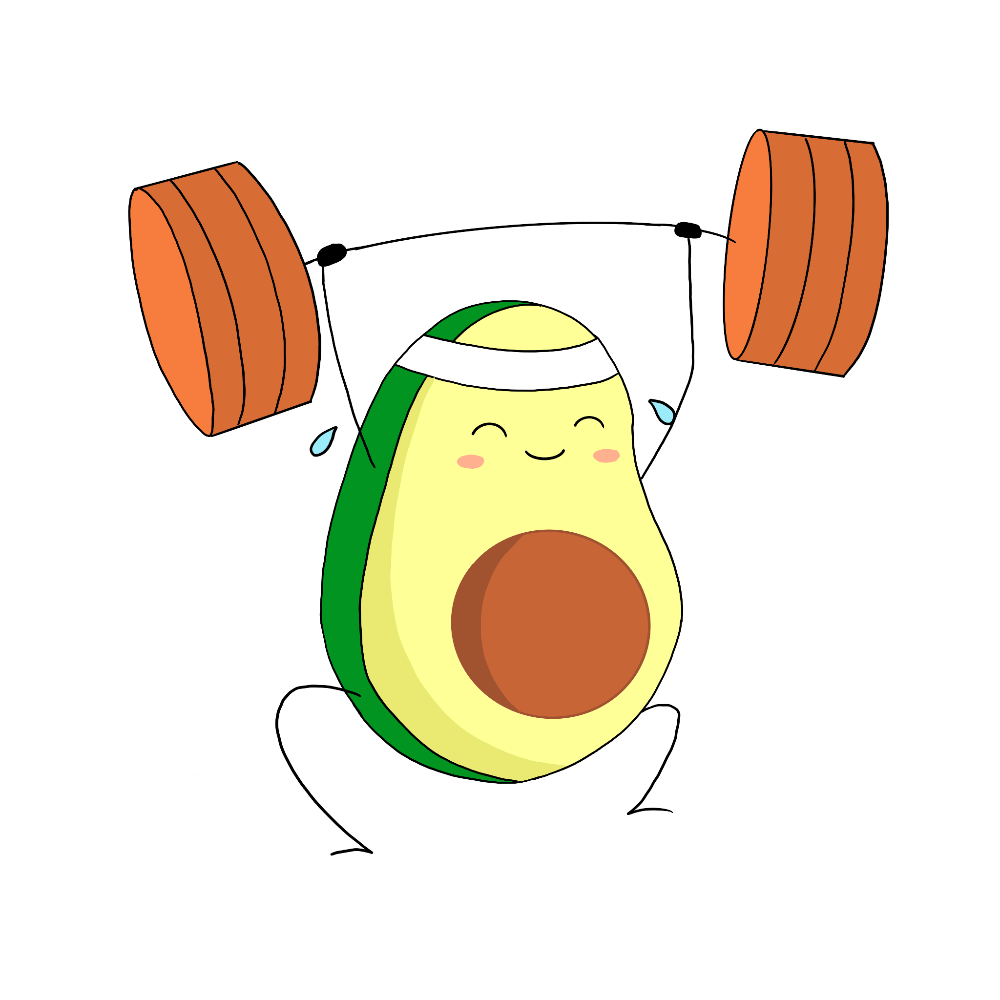
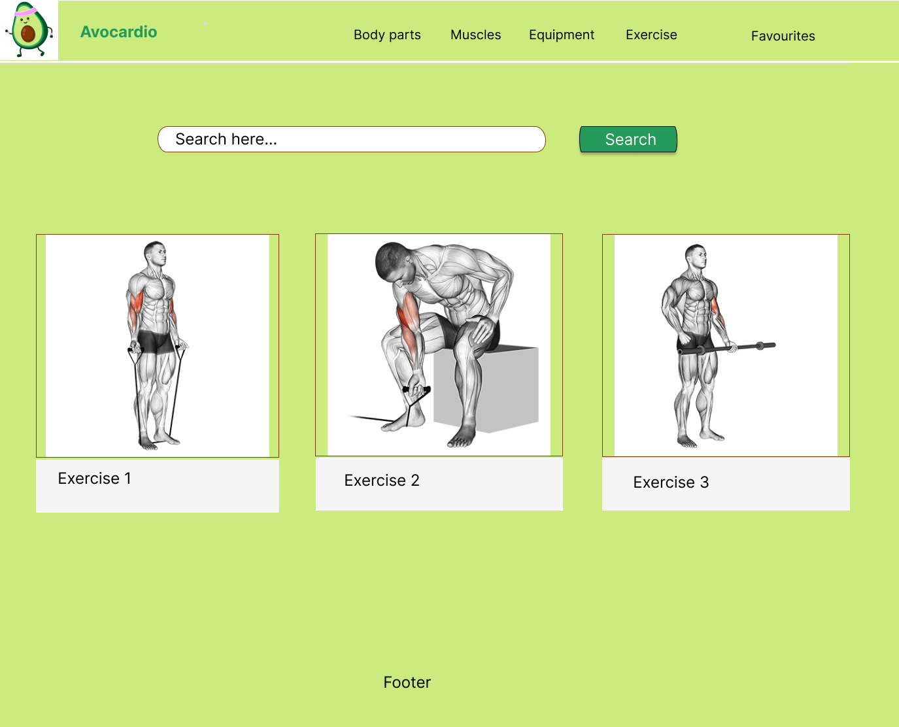

# Avocardio 

## General Description

Avocardio is a  based fitness project.

Users are able to search exercises by type (body part, muscle group, and equipment).

Search results are return in GIF format, that the user can easily follow along.

 powers the results displayed in this project.

## Wireframe

Below is our initial mockup of the project:

We used this to guide our decisions on page structure, component architecture, and initial MVP.

## MVP

When the user opens the page they are presented with the following elements:

- Navbar, which contains the Avocardio logo.
- Search Bar, which allows the user to search for exercises by body part.
  - Once a search is triggered, result count is limited to 3, which are displayed in card form, in a gallery configuration.
- Footer, which contains links to the Team's individual GitHub pages.

## MVP 2.0

Since we achieved our initial MVP fairly quickly, we decided to introduce some additional functionality:

- Navbar, which now contains a link to our "About" page.
- Search Bar now allows users to search by body type, muscle group, and equipment, and search bar displays a category separator.
  - User is now able to click on each of the search results and trigger a modal that displays exercise details.

## Tools

- 
- 
- 
- 
- 
- 
- 

## Running the project locally

Should you wish to run the project locally, follow [these steps](https://docs.github.com/en/repositories/creating-and-managing-repositories/cloning-a-repository) to clone the repository.

Once the repository is on your local machine, navigate to its location and run `npm i` to install the project dependencies.

Finally, run `npm start` to run the project in development mode and you should be able to now see it on your browser.

## Live

Deployed version of this project can be seen [here]().

## Project Presentation

Project presentation can be seen [here](https://docs.google.com/presentation/d/1ey4E9oBPxLmly65J8s72W0WljHtbvkLaLoKWw7G6NmY/edit?usp=share_link).

## Contributors

- [Marina](https://github.com/marinaongithub)
- [Sucaad](https://github.com/Sucaad-kulane)
- [Vanessa](https://github.com/vcdsc)
- [Wojciech](https://github.com/W-JK)

## License

- 

<!-- # Getting Started with Create React App

This project was bootstrapped with [Create React App](https://github.com/facebook/create-react-app).

## Available Scripts

In the project directory, you can run:

### `npm start`

Runs the app in the development mode.\
Open [http://localhost:3000](http://localhost:3000) to view it in your browser.

The page will reload when you make changes.\
You may also see any lint errors in the console.

### `npm test`

Launches the test runner in the interactive watch mode.\
See the section about [running tests](https://facebook.github.io/create-react-app/docs/running-tests) for more information.

### `npm run build`

Builds the app for production to the `build` folder.\
It correctly bundles React in production mode and optimizes the build for the best performance.

The build is minified and the filenames include the hashes.\
Your app is ready to be deployed!

See the section about [deployment](https://facebook.github.io/create-react-app/docs/deployment) for more information.

### `npm run eject`

**Note: this is a one-way operation. Once you `eject`, you can't go back!**

If you aren't satisfied with the build tool and configuration choices, you can `eject` at any time. This command will remove the single build dependency from your project.

Instead, it will copy all the configuration files and the transitive dependencies (webpack, Babel, ESLint, etc) right into your project so you have full control over them. All of the commands except `eject` will still work, but they will point to the copied scripts so you can tweak them. At this point you're on your own.

You don't have to ever use `eject`. The curated feature set is suitable for small and middle deployments, and you shouldn't feel obligated to use this feature. However we understand that this tool wouldn't be useful if you couldn't customize it when you are ready for it.

## Learn More

You can learn more in the [Create React App documentation](https://facebook.github.io/create-react-app/docs/getting-started).

To learn React, check out the [React documentation](https://reactjs.org/).

### Code Splitting

This section has moved here: [https://facebook.github.io/create-react-app/docs/code-splitting](https://facebook.github.io/create-react-app/docs/code-splitting)

### Analyzing the Bundle Size

This section has moved here: [https://facebook.github.io/create-react-app/docs/analyzing-the-bundle-size](https://facebook.github.io/create-react-app/docs/analyzing-the-bundle-size)

### Making a Progressive Web App

This section has moved here: [https://facebook.github.io/create-react-app/docs/making-a-progressive-web-app](https://facebook.github.io/create-react-app/docs/making-a-progressive-web-app)

### Advanced Configuration

This section has moved here: [https://facebook.github.io/create-react-app/docs/advanced-configuration](https://facebook.github.io/create-react-app/docs/advanced-configuration)

### Deployment

This section has moved here: [https://facebook.github.io/create-react-app/docs/deployment](https://facebook.github.io/create-react-app/docs/deployment)

### `npm run build` fails to minify

This section has moved here: [https://facebook.github.io/create-react-app/docs/troubleshooting#npm-run-build-fails-to-minify](https://facebook.github.io/create-react-app/docs/troubleshooting#npm-run-build-fails-to-minify) -->
