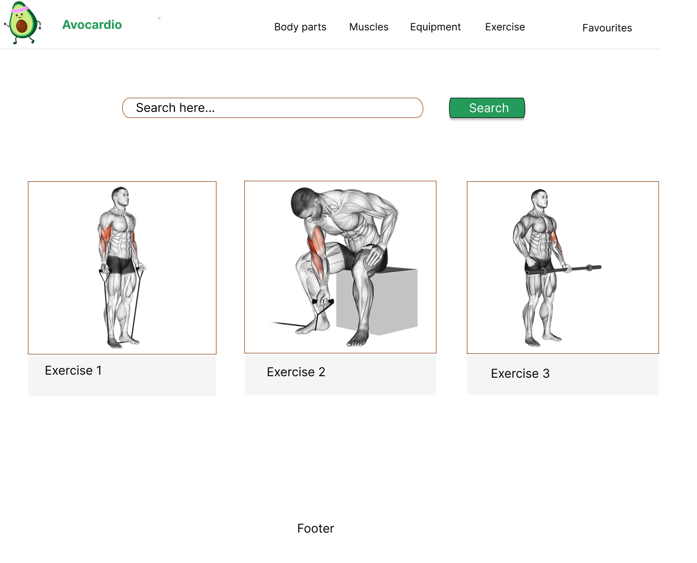

# Avocardio 

## General Description

Avocardio is a  based fitness project.

Users are able to search exercises by type (body part, muscle group, and equipment).

Search results are return in GIF format, that the user can easily follow along.

 powers the results displayed in this project.

## Wireframe

Below is our initial mockup of the project:

We used this to guide our decisions on page structure, component architecture, and initial MVP.

## MVP

When the user opens the page they are presented with the following elements:

- Navbar, which contains the Avocardio logo.
- Search Bar, which allows the user to search for exercises by body part.
  - Once a search is triggered, result count is limited to 3, which are displayed in card form, in a gallery configuration.
- Footer, which contains links to the Team's individual GitHub pages.

## MVP 2.0

Since we achieved our initial MVP fairly quickly, we decided to introduce some additional functionality:

- Navbar, which now contains a link to our "About" page.
- Search Bar now allows users to search by body type, muscle group, and equipment, and search bar displays a category separator. Users can either scroll through the list of categories, or they can type and see result suggestions that match.
  - User is now able to click on each of the search results and trigger a modal that displays exercise details.

## Tools

- 
- 
- 
- 
- 
- 
<!-- -  -->

## Running the project locally

Should you wish to run the project locally, follow [these steps](https://docs.github.com/en/repositories/creating-and-managing-repositories/cloning-a-repository) to clone the repository.

Once the repository is on your local machine, navigate to its location and run `npm i` to install the project dependencies.

Finally, run `npm start` to run the project in development mode and you should be able to now see it on your browser.

## Live

Deployed version of this project can be seen [here](https://sparkling-jalebi-c54467.netlify.app/).

## Project Demo

## Project Presentation

Project presentation can be seen [here](https://docs.google.com/presentation/d/1ey4E9oBPxLmly65J8s72W0WljHtbvkLaLoKWw7G6NmY/edit?usp=share_link).

## Contributors

- [Marina](https://github.com/marinaongithub)
- [Sucaad](https://github.com/Sucaad-kulane)
- [Vanessa](https://github.com/vcdsc)
- [Wojciech](https://github.com/W-JK)

## License

- 
